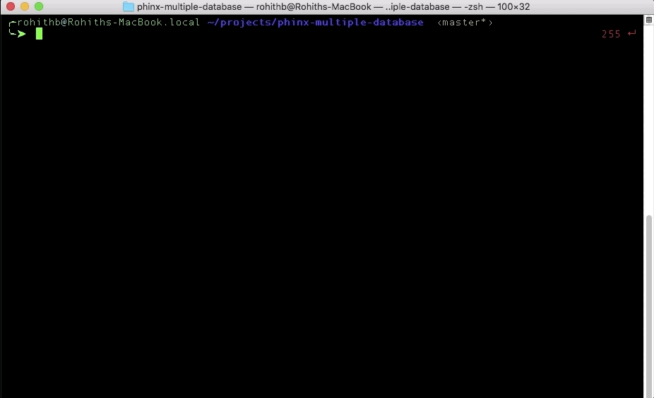

# Phinx Multiple Databases
## Intro
[Phinx](https://github.com/cakephp/phinx) is handy tool to manage database migrations.
But it does not support running same migrations for different databases. This will be 
really helpful in the case of multi-database multi-tenant applications.
This is a simple "hack" to use Phinx to easily run same migrations over multiple databases.



This is a part of Linways CLI (a command line tool we use internally for managing development and deployment of Linways AMS) ported out of Linways Frameworks.
We use this tool for deploying database migrations on hundreds of databases on multiple servers. 
### Features
* Effortlessly run same migrations on multiple databases. 
* Fake migrations on multiple databases.
## Setup
1. Download `lcli.phar` from the [latest release](https://github.com/linways/phinx-multiple-database/releases/latest).  
2. Create `phinx.yml` in the project root folder with the following content.
    ```yaml
    paths:
        migrations: %%PHINX_CONFIG_DIR%%/db/migrations
        seeds: %%PHINX_CONFIG_DIR%%/db/seeds
    
    environments:
        default_migration_table: db_migrations
        default_database: development
        development:
            adapter: mysql
            host: %%PHINX_DBHOST%%
            name: %%PHINX_DBNAME%%
            user: %%PHINX_DBUSER%%
            pass: %%PHINX_DBPASS%%
            port: 3306
            charset: utf8
    
    version_order: creation
    
    ```
    
3. Create a file `.cli.env` in the project root with the following variables.
  
    |Variable| Description|
    |--------|------------|
    |TENANT_DB|Name of the database for creating tenant management table.|
    |TENANT_DB_USER| DB username for this database|
    |TENANT_DB_PASSWORD| Password for the above mentioned user|
    |TENANT_DB_HOST| Host name (default: localhost)|
    |PASSWORD_ENCRYPTION_SECRET| A secret for encrypting tenant DB passwords|
    |PHINX_CONF| if `lcli.phar` is not at the same directory as of `phinx.yml`, use this variable to set the path of `phinx.yml`. If both are on same directory you can ignore this variable|

4. Run `./lcli.phar tenant:init` to create tenant management table in the specified database(`TENANT_DB`). 

The above steps will create a table `tenant` in the DB specified on `TENANT_DB` variable in `.cli.env`.
This table will be used for storing tenant information.  
```
+----------+--------------+------+-----+-----------+----------------+
| Field    | Type         | Null | Key | Default   | Extra          |
+----------+--------------+------+-----+-----------+----------------+
| id       | int(11)      | NO   | PRI | NULL      | auto_increment |
| code     | varchar(25)  | NO   | UNI | NULL      |                |
| name     | varchar(250) | NO   |     | NULL      |                |
| db       | varchar(50)  | NO   | UNI | NULL      |                |
| host     | varchar(50)  | NO   |     | localhost |                |
| username | varchar(50)  | NO   |     | NULL      |                |
| password | varchar(50)  | NO   |     | NULL      |                |
| isActive | tinyint(4)   | NO   |     | 1         |                |
+----------+--------------+------+-----+-----------+----------------+
```

## Usage
### Migrate
**Usage:**  
  `db:migrate [options] [--] [<tenant_code>]  `

**Arguments:**  
    `tenant_code`  :Tenant code for migration.(Works only if TENANT_DB env vars are set.)|  

**Options:**  

  |shortcut| name| Description|
  |---------|------|--------|
  |-a|--all| For executing migrations against all tenants. (Works only if TENANT_DB env vars are set.)  |
  |-d|--db=DB|For executing migrations against a single db.|
  |-t|--target=TARGET|If you want to run upto a particular migration. Target version is the time stamp in the migration file name.|
  |  |--host=HOST|Database host name/ip. [default: "localhost"]|
  |-u|--user=USER|Database user name. [default: "root"]|
  |-p|--pass|Prompt for database password. [default: "root"]|
  

**Sample Usages:**
  
`db:migrate TENANT1` - For running migrations for a tenant with code TENANT1  
`db:migrate --all` - For running migrations on all tenants  
`db:migrate --db=pro_db -u db_username -p` - For running migrations on a specific database.  
`db:migrate --all --target=20171018082229` - For migrating till a particular migration.  

### Migrate Fake
**Usage:**  
  `db:migrate-fake [options] [--] <migration_file_name> [<tenant_code>]`  

**Arguments:**  
`migration_file_name` : File name of the migration to be faked. eg: 20171018082229_scheduler_migrations  
`tenant_code` :Tenant code for faking the migration.(Works only if TENANT_DB env vars are set.)  

**Options:**  
 
|shortcut| name| Description|
|---------|------|--------|
|-a|--all| For faking migrations against all tenants. (Works only if TENANT_DB env vars are set.)|
|-d|--db=DB| for faking migrations against a single db|
|-r|--revert| For setting a migrations as NOT DONE. NB: This will not revert the actual database changes.|
|  |--host=HOST| Database host name/ip. [default: "localhost"]|
|-u|--user=USER| Database user name. [default: "root"]|
|-p|--pass|prompt for database password. [default: "root"]|

**Sample Usages:**

`db:migrate-fake 20171018082229_scheduler_migrations TENANT1` - For faking 'scheduler_migrations' for a tenant with code TENANT1  
`db:migrate-fake 20171018082229_scheduler_migrations --all ` - For faking 'scheduler_migrations' on all tenants using nucleus  
`db:migrate-fake 20171018082229_scheduler_migrations --db=pro_db -u db_username -p ` - For faking 'scheduler_migrations' on a specific database  
`db:migrate-fake 20171018082229_scheduler_migrations TENANT1 --revert` - For removing the particular migration from migration table. Effectively setting this migration as 'not migrated'    
               
## Todo
- [ ] Add create tenant command
- [ ] Encrypt DB password in the tenant table
- [ ] Migrate tests from original implementation of lcli (Linways Cli)
- [ ] Separate source code and example.
- [ ] Option to specify port number
